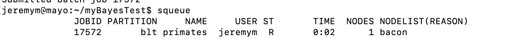

## Running jobs on BLT with MrBayes

Normally on BLT, we run paup commands directly in the command line. This can be fine, but won't work for longer running analyses. In those cases, it's necessary to set things up so your paup analysis is submitted to SLURM - the cluster's job scheduler. That way your analysis will run even if you disconnect from BLT.

First you'll probably want to create a folder in your home directory. In command line:

<pre><code>
mkdir ~/mrBayesProject
cd ~/mrBayesProject

</code></pre>

🧾 Step 1: Create a driver Nexus file
Create a new file called driver.nex where you list your commands. Below is a sample...yours will vary, depending upon what you're trying to do. Note that Mr Bayes doesn't like the "~" for file paths.

<pre><code>
#NEXUS
begin mrbayes;

    exe ../bio408/paup_nexus_files/primatemtDNAmb.nex;
    set autoclose=yes nowarn=yes;
    set quitonerror = no;
    lset nst=6 rates=gamma;             [General Time Reversible + Gamma rate variation]
    prset statefreqpr=dirichlet(1,1,1,1);
    mcmcp ngen=1000000 samplefreq=100 nchains=4 printfreq=1000 diagnfreq=10000 burninfrac=0.25;
    mcmcp filename=primatemtDNAmb_local;
    mcmc;

    sumt filename=/home/jeremym/mrBayesTest/primatemtDNAmb_local;

end;
</code></pre>
This acts as an instruction set to run commands in Mr Bayes.
[sample driver.nex file](driver.nex)

💻 Step 2: Write the Slurm job script
Create a file called run.sh:

<pre><code>
#!/bin/bash
#SBATCH --job-name=my_job
#SBATCH --output=mbayes_out.txt
#SBATCH --error=mbayes_err.txt
#SBATCH --time=01:00:00
#SBATCH --cpus-per-task=1
#SBATCH --mem=2G

# Navigate to your working directory
cd ~/mrBayesTest

#this points to a specific version of Mr Bayes that works with the cluster
mpirun -np 1 $HOME/opt/mrbayes/3.2.7/bin/mb driver.nex
</code></pre>
[sample run.sh file](run.sh)

🚀 Step 3: Submit the job to Slurm
Run the following command from the terminal:

<pre><code>
sbatch run.sh
</code></pre>

You can check the status of your job by running `squeue` in command line. This will display a list of currently running jobs:

If you don't see your job listed, it's no longer running. Then you can check the output and error files (specified in your run.sh file) to see if it worked.

